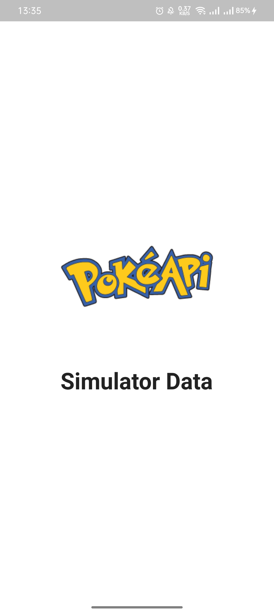
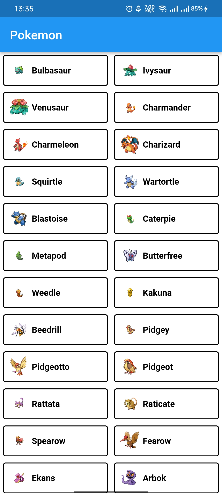
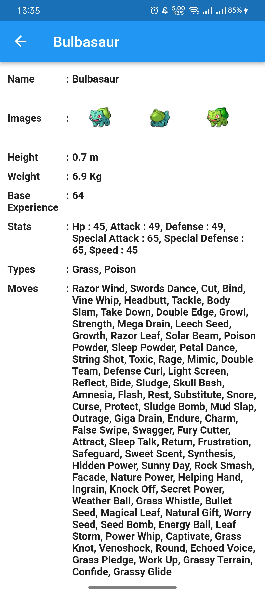

## Tentang Aplikasi

Poke Api adalah aplikasi Database Pokemon dari API Pokemon API (https://pokeapi.co/api/v2). Aplikasi ini dibangun menggunakan framework flutter. 
Aplikasi ini di bangun menggunakan :  
- [x] <a href = "https://pub.dev/packages/flutter_launcher_icons">Flutter Launcher Icons </a>
- [x] <a href = "https://pub.dev/packages/flutter_riverpod"> Riverpod</a>
- [x] <a href = "https://pub.dev/packages/flutter_dotenv"> flutter_dotenv</a>

Aplikasi ini memiliki beberapa fitur :
- [x] Halaman Splash
- [x] Halaman Daftar Pokemon
- [x] Halaman Detail Pokemon

## Preview Aplikasi

